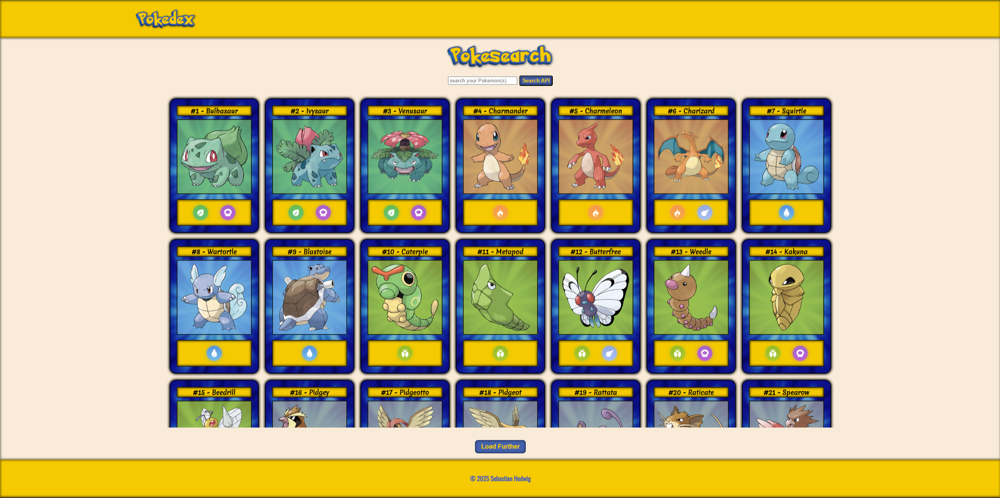

# Pokedex

A browser-based Pokedex project that loads Pokemon data from the [PokéAPI](https://pokeapi.co/) and displays it in searchable card views with detailed dialog pages.



## Features

- Loads Pokemon data from the PokéAPI
- Displays Pokemon as responsive cards
- Search function for Pokemon names
- Detail dialog with main data, stats, abilities and evolution information
- Type icons and themed card visuals
- Privacy Policy and Legal Notice pages rendered through templates
- Keyboard-accessible Pokemon cards and improved ARIA labels

## Tech Stack

- HTML
- CSS
- JavaScript
- PokéAPI

## Getting Started

Open `index.html` in a browser or run the project with a local development server, for example with the Live Server extension in VS Code.

## Legal Pages

The legal pages are rendered through `index.html` routes:

- `index.html?page=privacy`
- `index.html?page=impressum`

## Image and Data Sources

- Pokemon data: [PokéAPI](https://pokeapi.co/)
- Icons: [Flaticon](https://www.flaticon.com/)
- Card background: [Freepik](https://www.freepik.com/)

## Preview Image

The README preview expects the screenshot at:

```text
assets/img/readme-preview.png
```
